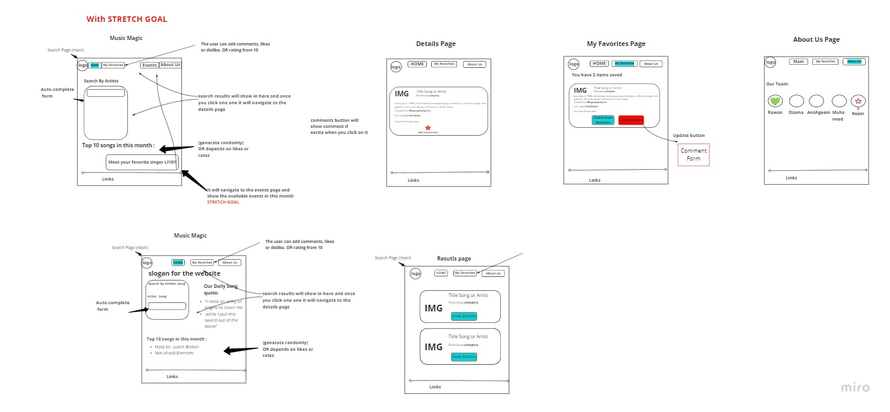
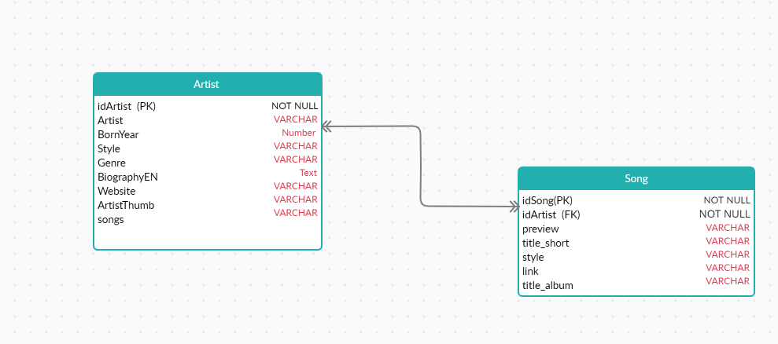

# Music-Magic-

## Group name: Ternaries.

## Project name: Magic Music . 

## Contributors 
1. Anagheem Bayan
2. Muhannad Almughrabi
3. Osama Noufal
4. Rawan Abu-yasin
5. Reem Al-qurm

## Synopsis 

- A website for the funky music fans they can search for their favorite songs or artists.  

## Problem Domain
- Help Music lover find their favorite songs and artists all in one place. 

## Minimum Viable Product (MVP) :
- Search for a song or artist, view their details, add to favorite list, add comment or recommend , and delete.

## Technologies

* HTML.
* CSS.
* Javascript.
* Node JS
* Postgress Database
* EJS

## Tools

* Google CHrome.
* Windows 10.
* Visual Studio Code.
* Git & Github.
* Heroku


## Installation 

An updated version of any Browser connected to an internet connection needs for viewing this project on Heroku.


## License

MIT License is used in this project. [License](LICENSE)

### A typical top-level directory layout

```
├── .gitignore             				
├── .eslintric.json             	 
├── LICENSE
├── README.md
├── data
│   ├── placeHolder1.json
│   ├── placeHolder2.json
│   └── schema.sql
├── node_modules
├── package-lock.json
├── package.json
├── project-images
│   ├── PlaceHolder-DBdiagram.jpg
│   ├── placeHolder-WRRC.jpg
│   └── placeHolder-WireFrame.jpg
├── public
│   ├── imgs
│   ├── js
│   │   └── app.js
│   └── styles
│       ├── base.css
│       ├── layout.css
│       ├── main.css
│       ├── modules.css
│       └── reset.css
├── server.js
└── views
    ├── layout
    │   ├── footer.ejs
    │   ├── head.ejs
    │   └── header.ejs
    └── pages
        └── index.ejs
        
```

## Team related topics discussed below..

## Conflict Plan

**What is the group process to resolve conflict, when it arises?**
1. we will do like a pull and the most voted choice for that conflict will be accepted, we support democratizes :D . 

**How will you raise concerns to members who are not adequately contributing?**
2. we will talk to him/her if he/she has any issues or any circumstances, if yes we will assign small tasks to him/her so he/she can follow up with us with an effort they could manage based on the situation, if not, we will know what's her/his problem and encourage him/her to do what he/she likes to, or provide any help they need in order to proceed with other members, if none of this works maybe we will tell the instructor to help us find a better solution.

**How and when will you escalate the conflict if your resolution attempts are unsuccessful?**
3. if we find carelessness and neglecting without any reasonable cause, in this case, we will refer to our instructor in order to not complicate the situation!

## Communication Plan

**How will you communicate after hours and on the weekend?**
1. it's optional to communicate on weekends and it will be over zoom , also it depends on our progress , we all prefer that each one of us is going with the group(the most voted decisions) but we are flexible and it's not mandatory to attend on weekends.

**What is your strategy for ensuring everyone’s voice is heard?**
2. We already discussed this that everyone should be comfortable with his work and free to seek any help no matter what is it and should speak up for any concern he/she has, and the strategy is to work as a friendly environment before anything else that all of us should be kind in it to ensure that everyone is comfortable to tell anything he/she feels.

**How will you ensure that you are creating a safe environment where everyone feels comfortable speaking up?**
3. Everyday at the morning we will ask everyone is he/she has any concerns about any thing related to the work in the day before and the group in general.


## Work Plan

**How you will identify tasks, assign tasks, know when they are complete, and manage work in general?**

1. We will distribute tasks randomly when there is no specific reason to assign them to a specific member , like when someone is capable of doing a task and see himself/herself can't do another one, if there anyone who doesn't have any problem doing that other thing, we will give that task following that priority of desire (like to do sth==> ==> doesn't matter => can't do sth), if there's a task like everyone wants to avoid or do as well, we will assign that task as pair programming, we also recommend works as pairs since its more enjoyable and combine an effort of two thus fewer mistakes to be there but it also can depend on our progress.

**What project management tool will be used?**

2. We will be using Zoom or Remo for late meetings after (official hours work), so we would like to have the ability to share the screen in the zoom main session, Github for the source code, Trello for tasks management and progress, slack, and WhatsApp for communication.


## Git process

**What components of your project will live on GitHub?**
1. the source code, specifically the main branch which we will be pushing to it when any feature is completed, if not we will still be working on another branch. 

**How will you share the repository with your teammates?**

2. Over slack. 

## What is your Git flow?

3. Hopefully, I'm getting the question right!, we will be working on branches other than the main, everyone will be working on his own branch, submitted PR when a feature is completely done to the main, two of the other members will be reviewing the PR and merge it, when any conflicts raised Reem will be there to fix them. 

### Will you be using a PR review workflow? If so, consider:

**How many people must review a PR?** 

- 2

**Who merges PRs?**

- Rawan & Muhannad. 

**How often will you merge?**

- When a specific feature is complete probably once a day for each one of us!

**How will you communicate that it’s time to merge?**

- When a feature is complete and accepted by most of the members/ or a page is almost completed of functionality we will hit a merge! So: it's when a feature is completed and they will be checked on the end of each day!

## User Stories
- As a user when I enter the homepage I want to see a slogan for what the website does. 
- As a user when I hit the homepage I want to see daily random song quotes, also i want to see the top ten songs.
- As a user when I hit the homepage I want to see a search bar to search for a specific song or an artist .
- As a user I'm on the results page after I searched for a specific song/artist. I want a link so I can click on it and see more details.
- As a user when I hit the details page I can see the information provided for that song\artist .
- As a user if i want to add it to my favourites i will click on the heart/star icon and it will be added to my favourite page.
- As a user when I hit the favourite page I'd like to see the total added items with its details.
- As a user when I hit the favourite page I'd like to have a comment button that will show a comment form to add  .
- As a user when I hit the favourite page I'd like to have a delete button to delete a song\artist added from the favourite and it will be removed .
- As a user when I hit the About Us page I can see who the developer of the website .
the recommendation button is a (STRECH GOAL).

## Wireframes



## DataBase Diagram



  
## Code Examples 

## Motivation

## API References

## Tests

